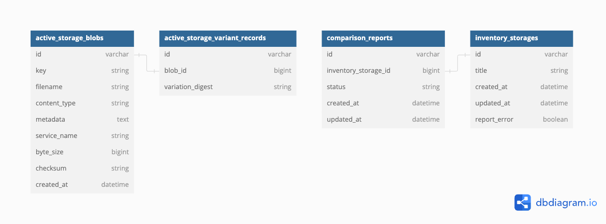

# Inventory Location Analyzer APP

# Overview
A web application designed to streamline inventory management in warehouse environments. By automating the comparison between expected and actual asset locations, efficient inventory tracking. 
Developed with Ruby on Rails, this application compares data from robotic warehouse scans with customer-provided data set,
and generate a comparison report showing discrepancies in both datasets.

# Prerequisite

```
Ruby 3.2.2
Rails 7.1.3
Postgresql
```
# Running application
1. clone the project
2. bundle install
3. rails db:create
4. rails db:migrate
5. Server should be up and running at localhost:3000
6. Hit Api endpoint via postman to save the JSON file.
7. Hit locations controller to see the page for uploading the CSV file and download report as well.


# Running tests
The tests coverage can be seen by running `rspec` for the entire app or individual files.


# Assumptions and constraints
To solve the given challenge i have made some assumptions and constriants to tackle this problem.
1) Datasets is not big enough for both files.
2) Every location name will be unique and cannot be duplicated as seen in the file structure.
3) There will be one customer file for every location scanned and that will follow the same content structure and defined.
4) For previously uploaded payload selection, 
 I am assuming to display the uploaded JSON files against the CSV on Index page.


# Implementation details
The Web Application comprises of different sections for handling different tasks.
- Api Endpoint for consuming JSON and storing in the data store.(`/api/inventory_storages`)
This will take JSON file as input parameter, validates the file and then store as file storage in database.
- Locations Controller
This Controller is responsible for: 
1) Showing all the JSON files and customer uploaded files with report status on index page.
2) Handling the customer upload csv and handling the Job to make comparison and generate report.

- Services
1) CSV generation service responsible for handling CSV generation.
2) File validation service responsible for handling validations & Error handling  for CSV and JSON files.
3) Inventory Comparison service responsible for making comparison between both files,
 generating report showing discrepancies,and generating CSV file.

- Job
1) Active Job used for handling background job running Inventory Comparison service 
 and generating report.

- Models 
1) Created two models one for report comparison and one for inventory storage.
2) Database structure looks like this:



3) Inventory Storage model is responsible for storing the JSON and CSV file using activestorage.
4) Comparison Report model is responsible for storing comparison report file and adding status for report generation outcome.

- Workflow for the Application 

1) Api Endpoint will be hit which will fetch the JSON file, validate file format using Json validation service(using the JSON Schema as defined in Schemas directory) and will be stored in file storage,
using ActiveStorage at local server.
2) User will be given link to upload the CSV file that is required to be compared with the
JSON file, upon uploading the CSV file, file format will be validated  using the services defined
3) on Successful CSV upload, background Job will be sent to make comparison using InventoryComparison
service and CSV will be generated for the report.
4) While running the background job user will be shown the status that report  is being generated, and then 
status will be shown whether the report has been generated successfully or not.
On successful report generation, user can download the report in CSV to view the result.
5) Currently there are two views for the Application, one for showing the files with timestamp and report download option,
second one is Customer file upload view.
6) Test coverage has been done for given flows and tried to cover the cases i could.
7) RuboCop for code formatter.

# Enhancements
- Better UI Functionality to incorporate Editing CSV file upload option on getting failing report generation.
- Test coverage can be improved better.
- Handle Location Validation for name code.
- Handle multiple locations validation. 
- Used file storage option to save files on local server, for scalability concerns dealing with large file sizes, we can 
consider moving towards cloud service for file storage i.e S3 in AWS.
- I wanted to use Sidekiq(but due to sidekiq version issue(machine specific) had to stick with Active Job)
 sidekiq would be better since its multi-threaded, would handle best for bulk enqueing, in terms of handling concurrent requests, getting real time response about Job status.

# Comparison Report 
- Comparison Report has been attached with project directory for review purposes.

# Final Remarks
-This is one way of solving this challenge, there can be  other solutions that can be
used to tackle the problem which can be discussed on call.

